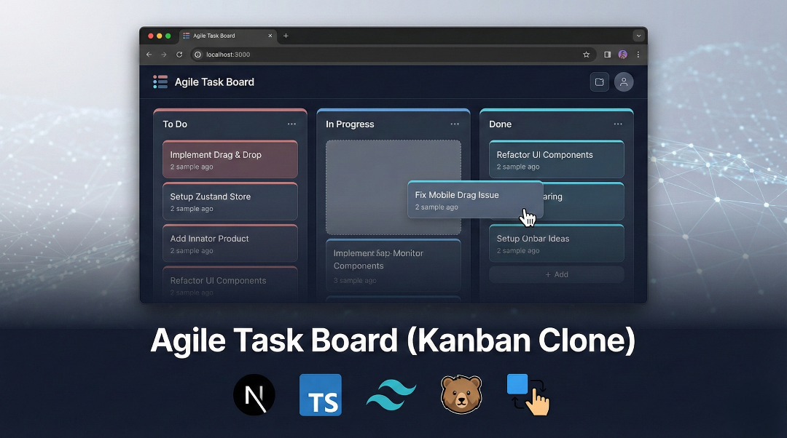

# Agile Task Board (Kanban Clone)

   
A high-performance, responsive Kanban board built with **Next.js 16 (App Router)** and **TypeScript**. 

This project goes beyond a simple CRUD app by implementing complex **Drag-and-Drop** physics, **Global State Management** with persistence, and **Optimized Rendering** patterns.

🔗 **Live Demo:** Vercel Link here.

## 🚀 Key Features

* **Complex Drag & Drop:**
    * Drag tasks between columns.
    * Reorder columns.
    * Smooth animations using `@dnd-kit` with `DragOverlay` for performance.
* **Production-Grade State Management:**
    * Powered by **Zustand** for normalized state.
    * **Persistence Middleware**: Automatically saves board state to LocalStorage.
* **Advanced UX Details:**
    * **Inline Editing:** Click-to-edit tasks and column titles (no modal fatigue).
    * **Auto-Focus & Blur-Save:** UX patterns similar to Trello/Jira.
    * **Mobile Optimized:** Implemented `TouchSensor` with delay/tolerance logic to distinguish between "swiping to scroll" and "holding to drag".
    * **Snap Scrolling:** CSS Scroll Snap for native-like horizontal navigation on mobile.
* **Architecture:**
    * **Separation of Concerns:** Logic isolated in custom hooks (`useKanbanDnD`).
    * **Type Safety:** Fully typed with TypeScript interfaces (`Task`, `Column`, `Id`).

## 🛠️ Tech Stack

* **Framework:** Next.js 16 (App Router)
* **Language:** TypeScript
* **Styling:** Tailwind CSS 
* **State Management:** Zustand (w/ Persist Middleware)
* **Drag & Drop:** @dnd-kit (Core, Sortable, Utilities)
* **Icons:** LordIcon

## 🏗️ Technical Highlights

### 1. Solving the "Drag vs Scroll" Conflict
On mobile devices, dragging an item often conflicts with scrolling the page. I implemented a custom sensor strategy:
* **PointerSensor**: Activates after 10px movement (prevents accidental drags).
* **TouchSensor**: Activates after 250ms press-and-hold (allows normal scrolling interaction).

### 2. State Optimization
To prevent unnecessary re-renders, the `KanbanBoard` component delegates logic to a custom hook `useKanbanDnD`. This hook manages the complex event handlers (`onDragStart`, `onDragOver`, `onDragEnd`) and coordinate math, keeping the UI layer clean and declarative.

### 3. Hydration & Persistence
Using Zustand's `persist` middleware caused hydration mismatches (Server HTML vs Client LocalStorage). I implemented a `useMounted` check to ensure the board only renders after the client has hydrated, preventing the "Text content does not match server-rendered HTML" error.

## 🏃‍♂️ Getting Started

1.  **Clone the repository**
    ```bash
    git clone https://github.com/D-Sync-Vivek/Agile-Task-Board.git
    cd project-name
    ```

2.  **Install dependencies**
    ```bash
    npm install
    ```

3.  **Run the development server**
    ```bash
    npm run dev
    ```

4.  **Open locally**
    Visit `http://localhost:3000`

## 🔮 Future Improvements

* **Backend Integration:** Replace LocalStorage with a real DB (PostgreSQL/Supabase).
* **Real-time Collab:** Add WebSockets for multi-user editing.
* **Tags & Colors:** Allow users to label tasks.

---

**Author:**  Vivek Kumar  
**LinkedIn:** [Vivek Kumar](https://www.linkedin.com/in/vivek-kumar-585121326/)  
**Version** 1.0